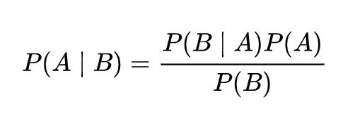
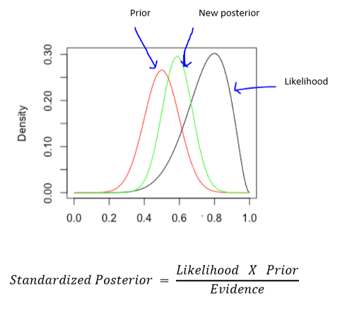
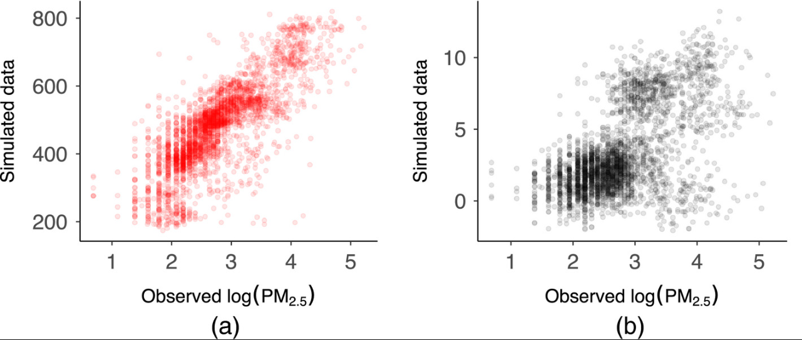
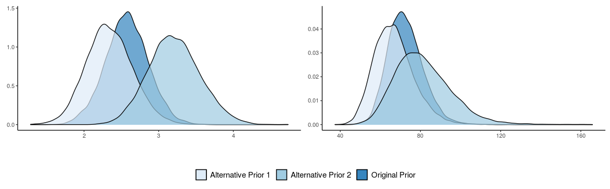
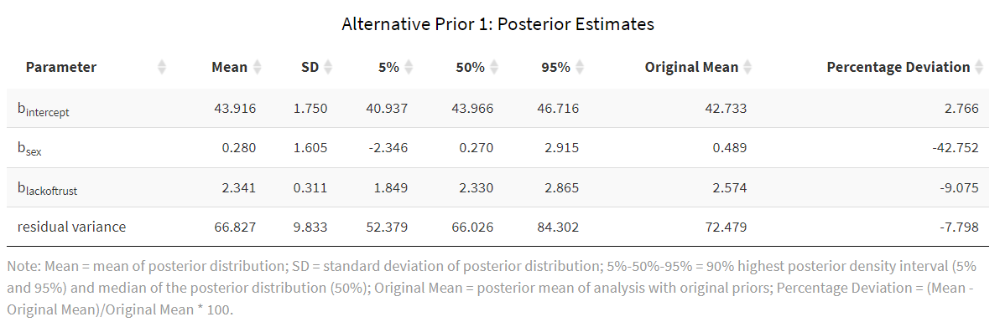

# Bayesian Modeling 

## Definition & Background:
Def: 

**Bayesian Statistics**

## Intuition Behind Method:
The background knowledge is expressed as a prior distribution.  The observational data is expressed in the form of a likelihood function. These are combined to determine the standardized posterior distribution, which can be used for making predictions about future events.

## Use Cases of Bayesian:
- **Small sample sizes**
- **Models are too complex for traditional methods** to handle 
- **Researcher wants to include background information** into the estimation process
- **Desire for complete distributions of credible values** rather than single value estimation

## Steps:
### Key Terms ###

**Prior Distribution** = previous beliefs or information about the parameters in a statistical model before seeing the data; probability distributions for the function parameters

**Likelihood** = the conditional probability distribution of the given parameters of the data, defined up to a constant

**Posterior Distribution** = a way to summarize one’s updated knowledge, balancing prior knowledge with observed data

**Hyper-parameters** = parameters that define the prior distribution, such as mean and variance for a normal distribution

**Prior Predictive Distribution** = the distribution for the joint distribution (e.g. the product of the likelihood and prior); a distribution of all possible samples that could occur if the model is true

**Hyper prior** =

**Marginalization** =

**Joint Probability** = the product of the likelihood and prior; the probability of two events happening together

**Conditional Distribution** =

### _Stage I: Prior Distribution_ ###

**1. Define, construct, or select the Priors (also called Prior Elicitation)**

Capture available knowledge about a given parameter in a statistical model via the prior distribution. This is typically determined before data collection. This step is one of the more important choices made when implementing a Bayesian model since it can have a substantial impact on the final results. The informativeness of the posterior depends on the informativeness of the prior.

Methods of obtaining priors:
- ask a subjectmatter expert
- results of a previous publication or analysis
- derived from sample data using MLE (!! Note: be careful of using the same data for crafting priors and as the observational data)

Types of Priors:
- Informative: a high amount of certainty in the estimated parameters; low variance
- Weakly Informative: middle-of-the-road certainty; moderate amount of variance; has less of an impact on the posterior distribution; similar to defining plausible ranges for parameter space
- Diffuse: a high amount of uncertainty; large variance; the observational data will have most of the impact on the posterior

### _Stage II: Likelihood Function_ ###

**2. Collect Data and Check Assumptions**

**3. Clean and Prepare Data**

**4. Determine Likelihood Function**

Determine the likelihood function (probability density function) using the observational data.

**5. Conduct a Prior Predictive Check**
comparing observed data to simulated data from the posterior (or prior) predictive distribution

The process of checking whether the priors make sense by generating data according to the prior in order to assess whether the results are within the plausible parameter space. This step is used to improve the understanding of the implications of the specified priors, not a method for changing the prior. 

Prior predictive checking compares the observed data with the prior predictive distribution and checks their compatibility. Using kernel density estimation, the observational data and the samples from the predictive distribution can be compared.

prior data-generating distribution p(y) could represent any data set that could plausibly be observed

 the standard concept of weakly informative priors, it is important that this prior predictive distribution for the data has at least some mass around extreme but plausible data sets. However, there should be no mass on completely implausible data sets. 

The prior predictive distribution is the distribution of observations "averaged" over all possible values of the parameter. 

Steps:

a. Simulate parameter values based on the specified prior distribution

b. Simulate sample data based on the likelihood function (step #4) using the simulated parameters (this is the same as simulating data from the joint distribution, which is the product of the likelihood and prior)

c. Create a series of visualizations to scroll through of simulated datasets that can be used to investigate the variability and multivariate structure of the distribution

d. Asses the simulated sample to determine if the data obeys physical constraints and matches your intuition

Example:

diffuse (a) and weakly informative priors (b)
show realizations from the prior predictive distribution using priors for the βs and τs that are vague and weakly informative respectively; the same N+(0,1) prior is used for σ in both cases; simulated data are plotted on the y-axis and observed data on the x-axis; because the simulations under the vague and weakly informative priors are so different. The data that are generated by (a) are completely impossible for the context of the example. Inspecting the graphs within the context of the problem (inspecting the y-axis range and what values are feasible), we conclude the diffuse priors do not actually respect the contextual knowledge.

### _Stage III: Posterior Distribution_ ###

Combine both the prior distribution and the likelihood function using Bayes’ theorem to output the posterior distribution. The posterior distribution reflects one’s updated knowledge, balancing prior knowledge with observed data, and is used to conduct probabilistic inferences. 

**6. Conduct Posterior Predictive Check***
The idea behind posterior predictive checking is simple: if a model is a good fit then we should be able to use it to generate data that looks a lot like the data we observed

posterior predictive checks are vital for model evaluation

This is a way to validate a model. The idea is to generate data from the model using parameters from draws from the posterior. It analyzes the degree to which data generated from the model deviate from data generated from the true distribution.

**7. Conduct a Sensitivity Analysis on Priors**

To fully understand the influence that the prior has on posterior estimates. thoroughly examining the impact of priors through a sensitivity analysis

examine how robust the original results are when the priors are altered, and the model is re-estimated.1 It can also be a method used to identify priors that would serve as a poor choice for the model or likelihood—an issue we expand on more in the discussion.

a. After posterior model is estimated and convergence is obtained for all model parameters, come up with a set of “competing” priors (for one or all parameters) to examine.

b. Obtain posterior model for the “competing” priors (check for parameter convergence) and compare with the original model. If choosing competeing priors for only one of your parameters, while the biggest change in posterior will probably be in that parameter, be sure to also look at the posteriors of the other parameters to see how they are affected. 

_Example of comparing the posterior distributions from competing priors:_

c. Evaluate how different or similar the posterior distributions are when different priors are formed, and whether the difference is substantively important. One way to evaluate this is to compute the percentage change in the average posterior estimate between models with different prior distributions. This bias estimate is displayed in the last column of the table. A high percentage of bias implies that the posterior estimate is sensitive to the prior distribution used.

d. Include sensitivity analysis results to comment on how robust (or not) the final model results are to different prior settings.

## Resources:
Bayesian Models
- https://osf.io/wdtmc
- https://bayesball.github.io/BOOK/bayesian-hierarchical-modeling.html
- https://www.astro.umd.edu/~miller/teaching/astr288a/lecture08.pdf
- https://www.r-bloggers.com/2019/05/bayesian-models-in-r-2/ (R)
- https://statswithr.github.io/book/the-basics-of-bayesian-statistics.html
- https://github.com/markdregan/Bayesian-Modelling-in-Python (Python)
- http://modernstatisticalworkflow.blogspot.com/2017/05/model-checking-with-log-posterior.html
- http://www.stat.columbia.edu/~gelman/book/BDA3.pdf
- https://nyu-cdsc.github.io/learningr/assets/kruschke_bayesian_in_R.pdf (R)

Prior Elicitation

- https://etd.ohiolink.edu/apexprod/rws_etd/send_file/send?accession=osu1306344172&disposition=inline
- https://www.geos.ed.ac.uk/~acurtis/assets/Runge_etal_BSSA_2013.pdf

Prior Predictive Check

- https://rss.onlinelibrary.wiley.com/doi/full/10.1111/rssa.12378 (R)
- http://bebi103.caltech.edu.s3-website-us-east-1.amazonaws.com/2018/tutorials/t6a_model_generation_and_prior_predictive_checks.html
- https://pablobernabeu.github.io/2022/bayesian-workflow-prior-determination-predictive-checks-and-sensitivity-analyses/

Posterior Predicitive Check & Sensitivity Analysis

- https://rss.onlinelibrary.wiley.com/doi/full/10.1111/rssa.12378 (R)
- http://www.stat.columbia.edu/~gelman/bayescomputation/bdachapter6.pdf
- https://www.frontiersin.org/articles/10.3389/fpsyg.2020.608045/full
