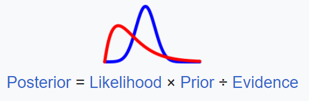

# Bayesian Hierarchical Modeling 
(also called multilevel modeling)

## Definition & Background:
Def: a statistical model written in multiple levels (that have a nested or hierarchy form) that estimates the parameters of the posterior distribution using the Bayesian method

**Bayesian Statistics**

## Intuition Behind Method:

## Use Cases of Bayesian:

## Steps:
### Key Terms ###
**Posterior Distribution** = 

## Resources:
- https://bayesball.github.io/BOOK/bayesian-hierarchical-modeling.html
- https://www.astro.umd.edu/~miller/teaching/astr288a/lecture08.pdf

