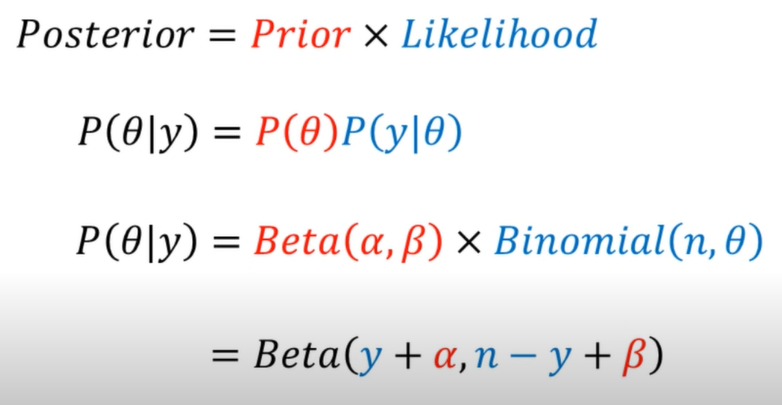
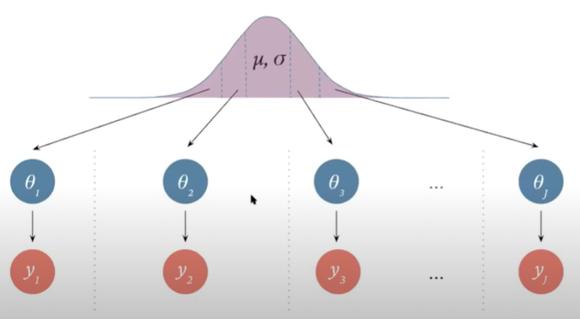

# Bayesian Modeling 

## Definition & Background:
Def: a way of approaching statistics where the parameters of a density function are treated as random variables, versus fixed values. Our beliefs about the values of the parameters can be expressed as a probability distribution, and just updated as we run experiments or collect data. Then, a final probability distribution of the parameter values is determined leveraging Bayes Theorem.

## Intuition Behind Method:
The background knowledge of possible values for a parameter we are trying to estimate is expressed as a prior distribution.  The observational data is expressed in the form of a likelihood function. These are combined to determine the standardized posterior distribution, which can be used for making predictions about future events.

## Use Cases of Bayesian:
- **Small sample sizes**
- **Models are too complex for traditional methods** to handle 
- **Researcher wants to include background information** into the estimation process
- **Desire for complete distributions of credible values** rather than single value estimation

## Key Terms

**Prior Distribution Function** = beliefs or information about the parameters of a statistical model before seeing the data; probability distributions for the posterior density function's parameters; P(theta)

**Likelihood Function** = the conditional probability distribution of the observational data; P(data | theta)

**Posterior Distribution Function** = a way to summarize one’s updated knowledge, balancing prior knowledge with observed data; a probability density function that combines the prior density function and the likelihood

**Hyper-parameters** = parameters that define the prior distribution, such as mean and variance for a normal distribution

**Prior Predictive Distribution** = the distribution for the joint distribution (e.g. the product of the likelihood and prior); a distribution of all possible samples that could occur if the model is true

**Hyper prior** = a prior distribution on a parameter of a prior distribution; allows one to express uncertainty around what the values of the prior distribution parameters should be

**Conjugate Prior** = case where the prior distribution and posterior distribution are in the same probability distribution family; gives a closed-form expression for the posterior where numerical integration would otherwise be necessary

**Marginalization** =

**Joint Probability** = the product of the likelihood and prior; the probability of two events happening together

**Conditional Distribution** =

## Steps:

### 1. Collect, Clean and Prepare Data

Having a good understanding of the context of the problem and data is often key in determining a prior.

### 2. Determine Likelihood Function

Determine the likelihood function (probability density function) using the observational data. The PDF will contain parameters which will be what you are trying to estimate. Prior distributions of possible parameter values will be choosen in the next step.

### 3. Define, construct, or select the parameter(s) Prior Distribution Function (process also called Prior Elicitation)

Priors allow you to capture available knowledge about a given parameter in a statistical model. Each parameter can have it's own prior distribution function. This step is one of the more important choices made when implementing a Bayesian model since it can have a substantial impact on the final results. The informativeness of the posterior depends on the informativeness of the prior.

**Methods of obtaining priors:**
- ask a subjectmatter expert
- results of a previous publication or analysis
- derived from sample data using MLE (!! Note: be careful of using the same data for crafting priors and as the observational data)
- specify parameter values associated with the 0.5 and 0.9 quantiles of the Normal density curve to identify a Normal prior

**Types of Priors:**
- Informative: a high amount of certainty in the estimated parameters; low variance
- Weakly Informative: middle-of-the-road certainty; moderate amount of variance; has less of an impact on the posterior distribution; similar to defining plausible ranges for parameter space
- Diffuse: a high amount of uncertainty; large variance; the observational data will have most of the impact on the posterior

### 4. Conduct Prior Predictive Checking

This is the process of checking whether the choosen parameter priors make sense by generating sample data according to the priors and the likelihood function, and seeing if the results represent any data set that could plausibly be observed. This step is used to improve the understanding of the implications of the specified priors. 

The generation of these samples creates the prior predictive distribution, which is the distribution of observations over all possible values of the parameter. It is important that this prior predictive distribution has some mass around extreme but plausible observations, and no mass on impossible observations. 

**Implementation:**

a. Simulate parameter value(s) based on the specified prior distribution(s)

b. Use those parameter values to generate a data sample using the likelihood function (this is the same as simulating data from the joint distribution, which is the product of the likelihood and prior)

c. Repeat many times to see what kind of data sets we might expect given the priors (e.g. generate 1000 samples)

d. Create a series of visualizations to scroll through the sample datasets to investigate the variability and multivariate structure of the distribution (e.g. scatterplot of sample data against observational data; empirical cumulative distribution plot of f(x) of each sample)

d. Asses the simulated sample to determine if the data obeys physical constraints and matches your intuition. If it doesn't, consider more appropriate priors

**Example:**

The below graphs shows the plots of samples generated from a diffuse prior (a) and weakly informative prior (b). Each prior produces very different sample data. The sample data generated by (a) are completely impossible for the context of the example. Inspecting the graphs within the context of the problem (inspecting the y-axis range and what values are feasible), we conclude the diffuse priors do not actually respect the contextual knowledge.

### 5. Calculate Postertior Distribution Function for each parameter, or Joint Distribution

Combine both the prior distribution and the likelihood function using Bayes’ theorem to output the posterior distribution for the parameters. The posterior distribution reflects one’s updated knowledge, balancing prior knowledge with observed data, and is used to conduct probabilistic inferences. 

In simple cases where the Prior distribution is a conjugate of the Likelihood, the posterior distribution will be the same function as the Prior.

To map out the shape of the posterior distribution function, the sampling algorithm MCMC is used. MCMC is used to generate a random sample that follows the probability distribution of the posterior, where what is referred to in MCMC as the "proposal density function" is our prior distribution function and what MCMC refers to as the "posterior density function" is our likelihood function. From there, we can use the probability distribution of the posterior to:

- calculate mean, median, mode of the parameter
- find probability that parameter falls within a specific range of values
- calculate a 95% confidence interval of the parameter

See https://github.com/akokotis/mcmc-overview for more details on the MCMC approach.

### 6. Conduct Posterior Predictive Check

The idea behind posterior predictive checking is simple: if a model is a good fit then we should be able to use it to generate data that looks a lot like the observational data. Posterior predictive checks are vital for model evaluation.

### 7. Conduct a Sensitivity Analysis on Priors

Sensitivity analysis is used to fully understand the influence that the prior has on posterior estimates. How robust are the original results when the priors are altered? 

**Implementation:**

a. After posterior model is estimated and convergence is obtained for all model parameters, come up with a set of “competing” priors (for one or all parameters) to examine.

b. Obtain posterior model for the “competing” priors (check for parameter convergence) and compare with the original model. If choosing competeing priors for only one of your parameters, while the biggest change in posterior will probably be in that parameter, be sure to also look at the posteriors of the other parameters to see how they are affected. 

_Example of comparing the posterior distributions from competing priors:_

c. Evaluate how different or similar the posterior distributions are when different priors are formed, and whether the difference is substantively important. One way to evaluate this is to compute the percentage change in the average posterior estimate between models with different prior distributions. This bias estimate is displayed in the last column of the table. A high percentage of bias implies that the posterior estimate is sensitive to the prior distribution used.

d. Include sensitivity analysis results to comment on how robust (or not) the final model results are to different prior settings.

# Bayesian Hierarchical Modeling 
(also called multilevel modeling)

## Definition & Background:
Def: a statistical model that contains a hierarchy of parameters, where there exist parameters that describe other parameters, fit using a Bayesian approach; data is group-level and can also be nested or hierarchy structure

### Key Terms ###
**Pooling** = the degree to which group-level data and model parameter estimates are aggregated together or all independent

**Complete Pooling** = to ignore any grouping within the data and describe all groups in the data using the same model; all groups have the same parameter values

**No Pooling** = to treat each group within data as its own dataset and fit a unique model for each group; all groups have independent parameter values and inferences about one group will be independent of the inferences on the remaining groups

**Partial Pooling** = to initially treat each group within data as its own dataset where each group has its own parameter, then introduce another variable to describe the distribution of the group parameter values (e.g. latent model); the priors on this latent model as called hyper-priors

**Hyper prior** = a prior distribution on a parameter of a prior distribution; allows one to express uncertainty around what the values of the prior distribution parameters should be

## Resources:
Bayesian Models
- https://osf.io/wdtmc
- http://bebi103.caltech.edu.s3-website-us-east-1.amazonaws.com/2018/tutorials/t6a_model_generation_and_prior_predictive_checks.html
- https://bayesball.github.io/BOOK/bayesian-hierarchical-modeling.html
- https://www.astro.umd.edu/~miller/teaching/astr288a/lecture08.pdf
- https://www.r-bloggers.com/2019/05/bayesian-models-in-r-2/ (R)
- https://statswithr.github.io/book/the-basics-of-bayesian-statistics.html
- https://github.com/markdregan/Bayesian-Modelling-in-Python (Python)
- http://modernstatisticalworkflow.blogspot.com/2017/05/model-checking-with-log-posterior.html
- http://www.stat.columbia.edu/~gelman/book/BDA3.pdf
- https://nyu-cdsc.github.io/learningr/assets/kruschke_bayesian_in_R.pdf (R)
- https://www.johndcook.com/blog/conjugate_prior_diagram/

Prior Elicitation

- https://etd.ohiolink.edu/apexprod/rws_etd/send_file/send?accession=osu1306344172&disposition=inline
- https://www.geos.ed.ac.uk/~acurtis/assets/Runge_etal_BSSA_2013.pdf

Prior Predictive Check

- https://rss.onlinelibrary.wiley.com/doi/full/10.1111/rssa.12378 (R)
- https://pablobernabeu.github.io/2022/bayesian-workflow-prior-determination-predictive-checks-and-sensitivity-analyses/

Posterior Predicitive Check & Sensitivity Analysis

- https://rss.onlinelibrary.wiley.com/doi/full/10.1111/rssa.12378 (R)
- http://www.stat.columbia.edu/~gelman/bayescomputation/bdachapter6.pdf
- https://www.frontiersin.org/articles/10.3389/fpsyg.2020.608045/full

Bayesian Hierarchical Modeling

- https://www.pymc.io/projects/examples/en/latest/case_studies/rugby_analytics.html#id5 (Python; PyMC)
- https://github.com/markdregan/Bayesian-Modelling-in-Python/blob/master/Section%203.%20Hierarchical%20modelling.ipynb (Python, PyMC3)
- https://bayesball.github.io/BOOK/bayesian-hierarchical-modeling.html#example-ratings-of-animation-movies (R, JAGS)
- https://www.intechopen.com/chapters/82619 
